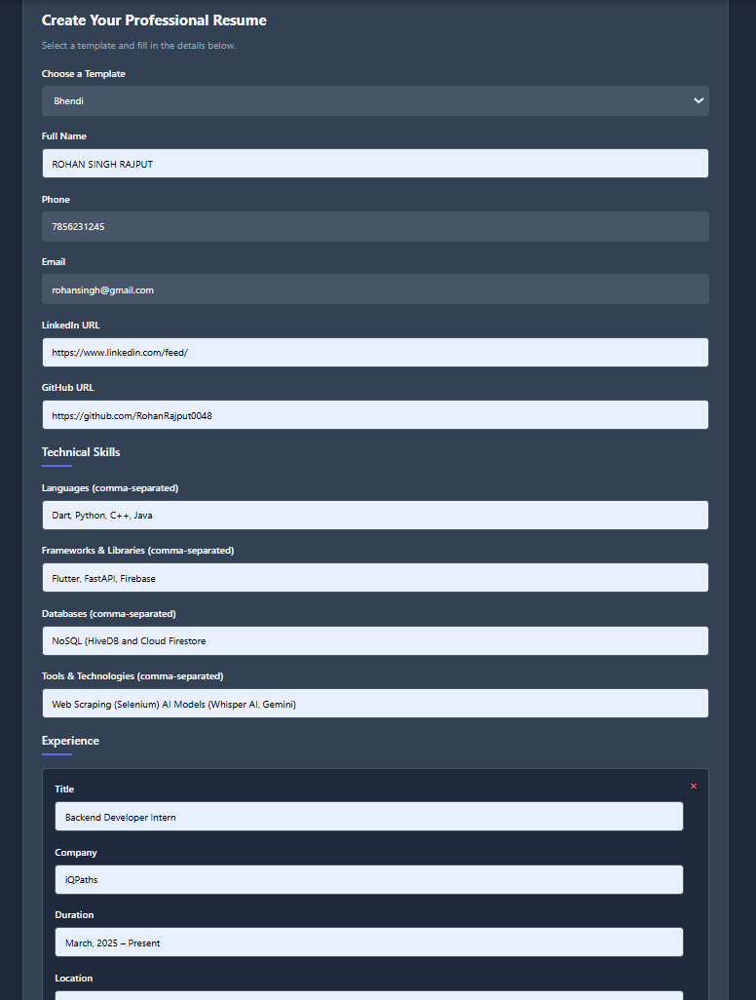
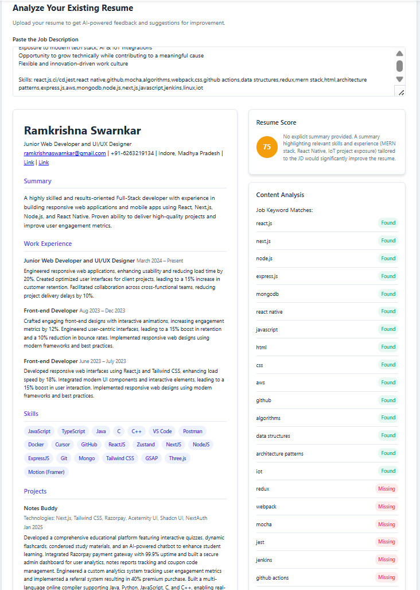

# 🚀 AI-Powered Resume Builder and Analyzer

An intuitive web platform designed to help job seekers, students, and professionals create polished resumes and analyze them using AI-driven insights — no technical background required!

**Build, Analyze, and Improve your resume in minutes!**

---

## ✨ Key Features

📄 **1. Resume Builder**
   - Create professional resumes effortlessly through a user-friendly form interface.
   - No templates to select manually — just fill out your information and get a ready-to-download resume!
   - Auto-formatting ensures a clean professional look.
   - Download your resume instantly.

🧠 **2. Resume Analyzer**
   - Get instant AI-powered feedback on your uploaded resume.
   - Upload an existing resume file.
   - Enter a job description you are targeting.
   - Receive structured feedback on skills match, experience fit, and improvement suggestions.

🔥 **3. Quick Access (No Sign-up)**
   - No login or registration is needed — users can start building and analyzing resumes immediately, making the platform fast, lightweight, and accessible.

📱 **4. Fully Responsive Design**
   - Access and use the platform across any device: Desktop 💻, Tablet 📱, Smartphone 📱.
   - The layout automatically adjusts for a seamless experience.

---

## 📸 Screenshots 


*   _Resume Builder Form:_ 
*   _Resume Analyzer Result:_ 

---

## 📂 Project Structure

```
    Mini_Project/
    ├── backend/
    │   ├── controllers/       # Logic for resume analysis
    │   ├── routes/            # API endpoints
    │   ├── utils/             # Helper functions for parsing and scoring resumes
    │   ├── uploads/           # Folder for temporarily storing uploaded resumes
    │   ├── index.js           # Backend entry point
    │   └── package.json       # Backend dependencies
    ├── frontend/
    │   └── (Frontend pages, components, assets)
```
---
## 🛠️ Tech Stack

| Part          | Technology                                       |
|---------------|--------------------------------------------------|
| Frontend      | HTML, CSS, JavaScript (React/Next.js if applicable) |
| Backend       | Node.js, Express.js                              |
| AI Integration| Gemini API (or other suitable NLP models)        |
| File Uploads  | Multer                                           |
| API Calls     | Axios (or native Fetch API)                      |

---

## ⚙️ How to Run Locally

Follow these simple steps to set up the project on your machine:

1.  **Clone the Repository**
    ```bash
    git clone https://github.com/your-username/ai-resume-builder-analyzer.git
    cd ai-resume-builder-analyzer
    ```

2.  **Setup the Backend**
    ```bash
    cd backend
    npm install
    ```
    > **Important:** Configure any required API keys (like for the Gemini API) within the backend's configuration files or environment variables before starting. Refer to backend documentation/code for specifics.
    ```bash
    npm start
    ```
    The backend server will start, typically at `http://localhost:5000`.

3.  **Setup the Frontend**
    *(Adapt these steps based on your specific frontend framework)*

    *If using plain HTML/CSS/JS, you might just open the `index.html` file.*

    *If using React/Next.js:*
    ```bash
    cd ../frontend
    npm install
    npm run dev  # Or your specific start command (e.g., npm start)
    ```
    The frontend development server will start, typically at `http://localhost:3000`.

4.  **Access the Application**
    Open your web browser and navigate to the frontend URL (e.g., `http://localhost:3000`).

---

## 🚀 Future Enhancements

*   ✏️ **Auto-suggestion:** Provide dynamic suggestions to improve resume content during the building phase.
*   📄 **Multiple Export Formats:** Add support for exporting resumes as PDF, DOCX, etc.
*   🔒 **User Authentication:** Implement user accounts for saving resumes and tracking analysis history.
*   🌙 **Dark Mode:** Add a theme toggle for dark mode preference.
*   🏆 **Advanced Scoring:** Develop more sophisticated resume scoring based on industry benchmarks and specific job roles.

---

## 📜 License

This project is open-source and available under the [MIT License](LICENSE). 

---

## 👌 Acknowledgments

*   [Gemini AI](https://ai.google.dev/) (or the specific NLP provider used) for the powerful natural language processing capabilities.
*   All the open-source libraries and frameworks that made development faster and easier!

---


## 📬 Contact
Made by Rohan Singh Rajput
📫 [Gmail](rohan7999singh@gmail.com) | [LinkedIn](https://www.linkedin.com/in/rohan-singh-rajput-9ba442266/) | [GitHub](https://github.com/RohanRajput0048)

